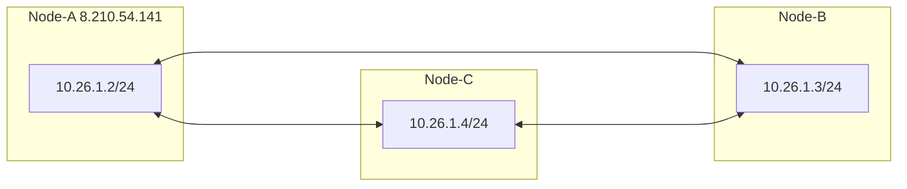
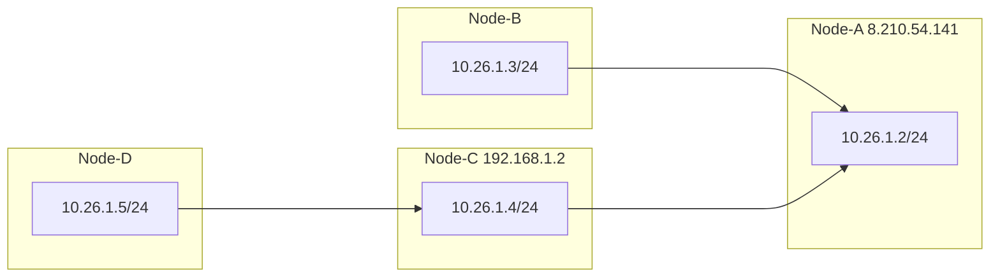

NetLink is a decentralized networking tool built on the [rustp2p](https://crates.io/crates/rustp2p) library.

```
Usage: netLink.exe [OPTIONS] --local <LOCAL IP> --group-code <GROUP CODE>

Options:
  -p, --peer <PEER>              Peer node address. e.g.: -p tcp://192.168.10.13:23333 -p udp://192.168.10.23:23333
  -l, --local <LOCAL IP>         Local node IP and prefix. e.g.: -l 10.26.0.2/24
  -g, --group-code <GROUP CODE>  Nodes with the same group_code can form a network (Maximum length 16)
  -P, --port <PORT>              Listen local port
  -b, --bind-dev <DEVICE NAME>   Bind the outgoing network interface (using the interface name). e.g.: -b eth0
      --threads <THREADS>        Set the number of threads, default to 2
  -e, --encrypt <PASSWORD>       Enable data encryption. e.g.: -e "password"
  -a, --algorithm <ALGORITHM>    Set encryption algorithm. Optional aes-gcm/chacha20-poly1305/xor, default is chacha20-poly1305
      --exit-node <EXIT_NODE>    Global exit node,please use it together with '--bind-dev'
 ```

## Features

| Features             |   |
|----------------------|---| 
| ***Decentralized***  | ✅ |
| ***Cross-platform*** | ✅ |
| ***NAT traversal***  | ✅ | 
| ***Subnet route***   | ✅ | 
| ***Encryption***     | ✅ | 
| ***Efficient***      | ✅ | 
| ***IPv6/Ipv4***      | ✅ | 
| ***UDP/TCP***        | ✅ | 

## Quick Start



1. Node-A
    ```
    ./netLink --group-code 123 --local 10.26.1.2/24
    ```
2. Node-B
    ```
    ./netLink --group-code 123 --local 10.26.1.3/24 --peer 8.210.54.141:23333
    ```
3. Node-C
    ```
    ./netLink --group-code 123 --local 10.26.1.4/24 --peer 8.210.54.141:23333
    ```
4. Nodes A, B, and C can access each other

## Multi Node


```
Node-A: ./netLink --group-code 123 --local 10.26.1.2/24
Node-B: ./netLink --group-code 123 --local 10.26.1.3/24 --peer 8.210.54.141:23333
Node-C: ./netLink --group-code 123 --local 10.26.1.4/24 --peer 8.210.54.141:23333
Node-D: ./netLink --group-code 123 --local 10.26.1.4/24 --peer 192.168.1.2:23333
```
All connected nodes can access each other. 

Furthermore, multiple nodes can be connected using '-peer'.  
example：
```
Node-A: ./netLink --group-code 123 --local 10.26.1.2/24
Node-B: ./netLink --group-code 123 --local 10.26.1.3/24 --peer 8.210.54.141:23333
Node-C: ./netLink --group-code 123 --local 10.26.1.4/24 --peer 8.210.54.141:23333
Node-D: ./netLink --group-code 123 --local 10.26.1.4/24 --peer 192.168.1.2:23333 --peer 8.210.54.141:23333
```

## Free community nodes

- --peer tcp://198.46.149.74:23333