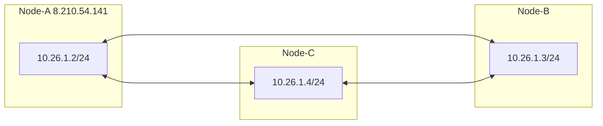
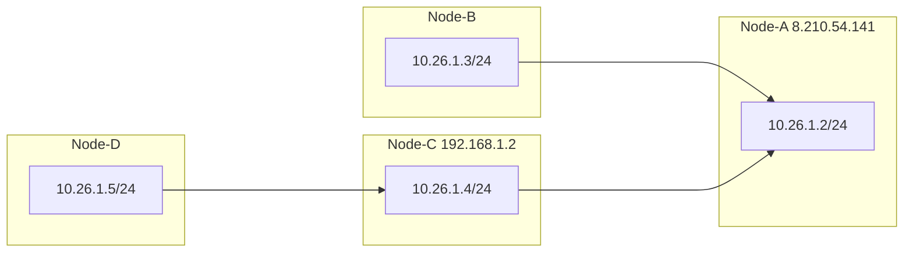

<p align="center">
  <a href="./README.zh-CN.md">简体中文</a> |
  <a href="./README.md">English</a>
</p>

NetLink is a decentralized networking tool built on the [rustp2p](https://crates.io/crates/rustp2p) library.

```
Usage: ./netLink.exe 
Usage: ./netLink.exe --api_addr 192.168.0.1:8080
Usage: netLink.exe [OPTIONS] --local <LOCAL IP> --group-code <GROUP CODE>

Options:
  -p, --peer <PEER>              Peer node address. e.g.: -p tcp://192.168.10.13:23333 -p udp://192.168.10.23:23333 -p txt://domain
  -l, --local <LOCAL IP>         Local node IP and prefix.If there is no 'prefix', Will not enable Tun. e.g.: -l 10.26.0.2/24
  -g, --group-code <GROUP CODE>  Nodes with the same group_code can form a network (Maximum length 16)
  -P, --port <PORT>              Listen local port [default: 23333]
  -b, --bind-dev <DEVICE NAME>   Bind the outgoing network interface (using the interface name). e.g.: -b eth0
      --threads <THREADS>        Set the number of threads [default: 2]
  -e, --encrypt <PASSWORD>       Enable data encryption. e.g.: -e "password"
  -a, --algorithm <ALGORITHM>    Set encryption algorithm. Optional aes-gcm/chacha20-poly1305/xor [default: chacha20-poly1305]
      --exit-node <EXIT_NODE>    Global exit node,please use it together with '--bind-dev'
      --tun-name <TUN_NAME>      Set tun name
      --mtu <MTU>                Set tun mtu
  -X, --filter <FILTER>          Group code whitelist, using regular expressions
  -f, --config <CONFIG>          Start using configuration file
      --api-addr <API_ADDR>      Set backend http server address [default: 127.0.0.1:23336]
      --api-disable              Disable backend http server
      --username <USER_NAME>     http username to login
      --password <PASSWORD>      http password to login
  -h, --help                     Print help information
  -V, --version                  Print version information

 ```

## Start with config file

<details> <summary>open</summary>

```yaml
## ./netLink --config <config_file_path>
## On demand use, unnecessary configurations can be deleted

## Api server host. default is "127.0.0.1:23336"
#api_addr: "127.0.0.1:23336"
## Disable api. api_disable:true
#api_disable: false
## Number of program task threads. default is 2
#threads: 2
## http username to login
#username: 
## http password to login
#password: 

## group code. cannot be empty
group_code: String
## node tun ipv4. cannot be empty
node_ipv4: "10.26.1.2"
## node tun network prefix. default is 24.If prefix=0, do not listen to the Tun network, and can only act as a relay node at this time
#prefix: 24
## node tun ipv6. The program will automatically generate node_ipv6
# node_ipv6: 
# prefix_v6: 96

## tun device name. The program will automatically generate tun_name
#tun_name: "tun3"
## Enable data encryption
#encrypt: "password"
## Set encryption algorithm. Optional aes-gcm/chacha20-poly1305/xor. default is chacha20-poly1305
#algorithm: "chacha20-poly1305"
##   Listen local port. default is 23333
# port: 23333
## Peer node address
#peer:
#   - udp://192.168.10.23:23333
#   - tcp://192.168.10.23:23333
## Bind the outgoing network interface (using the interface name)
#bind_dev_name: "eth0"
## Global exit node,please use it together with "bind_dev_name"
#exit_node: 
## Set tun mtu
#mtu: 1400
## Group code whitelist, using regular expressions
#group_code_filter:
#   - ^test # Starting with 'test'
#   - ^pass$ # eq pass

## stun server addr
#udp_stun:
#   - stun1.l.google.com:19302
#   - stun2.l.google.com:19302
#tcp_stun:
#   - stun.flashdance.cx
#   - stun.nextcloud.com:443

```

</details>

## Web UI

[netlink-app](https://github.com/rustp2p/netlink-app)

### Usage Instructions:

#### 1. Launch using a Browser:

1. Start netlink.
2. Access http://127.0.0.1:23336 using a browser.

#### 2. Launch using Tauri Executable:

1. Start netlink.
2. Open the netlink-app.

## Features

| Features                |   |
|-------------------------|---| 
| **Decentralized**       | ✅ |
| **Cross-platform**      | ✅ |
| **NAT traversal**       | ✅ | 
| **Subnet route**        | ✅ | 
| **Encryption**          | ✅ | 
| **Efficient**           | ✅ | 
| **HTTP/Rust/C/JNI API** | ✅ | 
| **IPv6/IPv4**           | ✅ | 
| **UDP/TCP**             | ✅ | 

## Quick Start



1. Node-A
    ```
    ./netLink --group-code 123 --local 10.26.1.2/24
    ```
2. Node-B
    ```
    ./netLink --group-code 123 --local 10.26.1.3/24 --peer 8.210.54.141:23333
    ```
3. Node-C
    ```
    ./netLink --group-code 123 --local 10.26.1.4/24 --peer 8.210.54.141:23333
    ```
4. Nodes A, B, and C can access each other

## Multi Node



```
Node-A: ./netLink --group-code 123 --local 10.26.1.2/24
Node-B: ./netLink --group-code 123 --local 10.26.1.3/24 --peer 8.210.54.141:23333
Node-C: ./netLink --group-code 123 --local 10.26.1.4/24 --peer 8.210.54.141:23333
Node-D: ./netLink --group-code 123 --local 10.26.1.5/24 --peer 192.168.1.2:23333
```

All connected nodes can access each other.

Furthermore, multiple nodes can be connected using '-peer'.  
example：

```
Node-A: ./netLink --group-code 123 --local 10.26.1.2/24
Node-B: ./netLink --group-code 123 --local 10.26.1.3/24 --peer 8.210.54.141:23333
Node-C: ./netLink --group-code 123 --local 10.26.1.4/24 --peer 8.210.54.141:23333
Node-D: ./netLink --group-code 123 --local 10.26.1.5/24 --peer 192.168.1.2:23333 --peer 8.210.54.141:23333
```

## Subnet route

```
Public Node-S: 8.210.54.141

Subnet 1: 192.168.10.0/24
      Node-A: 192.168.10.2
      Node-B: 192.168.10.3
      
Other subnet:   
      Node-C

Node-S: ./netLink --group-code xxxx --local 10.26.1.1
Node-A: ./netLink --group-code 123 --local 10.26.1.3/24 --peer 8.210.54.141:23333
Node-C: ./netLink --group-code 123 --local 10.26.1.4/24 --peer 8.210.54.141:23333

Node-C <--> Node-A(192.168.10.2) <--> Node-B(192.168.10.3)
```

1. **Step 1 : Node-A Configure network card forwarding**

> forward the traffic whose source is within 10.26.1.0/24 to the specified network interface

**Linux**

   ```
   sudo sysctl -w net.ipv4.ip_forward=1
   sudo iptables -t nat -A POSTROUTING  -o eth0 -s 10.26.1.0/24 -j MASQUERADE
   ```

**Windows**

   ```
   New-NetNat -Name testSubnet -InternalIPInterfaceAddressPrefix 10.26.1.0/24
   ```

**Macos**

   ```
   sudo sysctl -w net.ipv4.ip_forward=1
   echo "nat on en0 from 10.26.1.0/24 to any -> (en0)" | sudo tee -a /etc/pf.conf
   sudo pfctl -f /etc/pf.conf -e
   ```

2. **Step 2 : Node-C Configure route**

> route all traffic whose destination is within 192.168.10.0/24 to 10.26.1.3(i.e. the node_id of Node-A)

**Linux**

   ```
   sudo ip route add 192.168.10.0/24 via 10.26.1.3 dev <netLink_tun_name>
   ```

**Windows**

   ```
   route add 192.168.10.0 mask 255.255.255.0 10.26.1.3 if <netLink_tun_index>
   ```

**Macos**

   ```
   sudo route -n add 192.168.10.0/24 10.26.1.3 -interface <netLink_tun_name>
   ```

At this point, Node-C can access the IP address of Node-B(192.168.10.3) via Node-A as if Node-C was directly connected
to Node-B.

## Link library

https://github.com/rustp2p/NetLink_adapter

## Contact

- TG: https://t.me/+hdMW5gWNNBphZDI1
- QQ group: 211072783

## Free community nodes

- --peer tcp://198.46.149.74:23333
