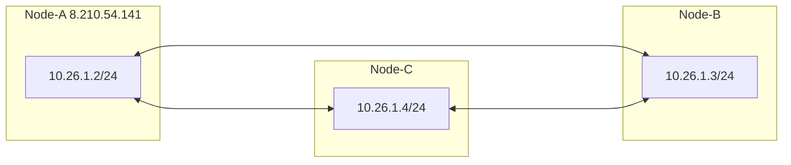
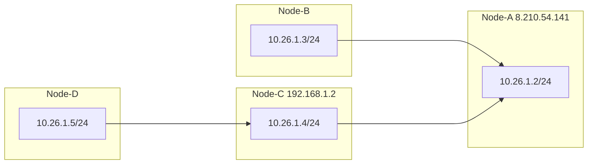

<p align="center">
  <a href="./README.zh-CN.md">简体中文</a> |
  <a href="./README.md">English</a>
</p>

`NetLink` 是建立在[rustp2p](https://crates.io/crates/rustp2p)库基础上的去中心化的网络工具.

## 使用

```
管理员权限命令行输入: netLink.exe [OPTIONS] --local <LOCAL IP> --group-code <GROUP CODE>

Commands:
  cmd   Backend command
  help  打印帮助信息

Options:
  -p, --peer <PEER>              远端节点地址(需可直接访问). 如: -p tcp://192.168.10.13:23333 或 -p udp://192.168.10.23:23333
  -l, --local <LOCAL IP>         设定本地节点地址 CIDR格式. 如: -l 10.26.0.2/24
  -g, --group-code <GROUP CODE>  节点所在组的名称(最大长度16),只有同一组的节点才能进行数据访问
  -P, --port <PORT>              本地监听地址
  -b, --bind-dev <DEVICE NAME>   指定流量出口网卡名. 如: -b eth0
      --threads <THREADS>        设置使用线程数, 默认两个线程
  -e, --encrypt <PASSWORD>       设定秘钥并开启加密. 如: -e "password"
  -a, --algorithm <ALGORITHM>    设定加密算法. 可选择算法: aes-gcm/chacha20-poly1305/xor, 默认是：chacha20-poly1305
      --exit-node <EXIT_NODE>    网关节点，请配合'--bind-dev'使用
      --tun-name <TUN_NAME>      设定本地tun的名称
  -f, --config <CONFIG>          使用配置文件启动

 ```

## 使用配置文件启动

<details> <summary>展开</summary>

```yaml
## ./netLink --config <config_file_path>
## 按需修改

## 后台命令服务监听地址. 默认值 "127.0.0.1"
#cmd_host: "127.0.0.1"
## 后台命令服务监听端口. 默认值 23336
#cmd_port: 23336
## 工作线程数. 默认值 2
#threads: 2
## 组编号，必填
group_code: String
## 虚拟ipv4 必填
node_ipv4: "10.26.1.2"
## 网段，默认值24，填0则不监听tun网络
#prefix: 24
## 虚拟ipv6,会自动生成
# node_ipv6: 
# prefix_v6: 96

## tun网卡名称，会自己生成
#tun_name: "tun3"
## 开启加密，设置加密密码
#encrypt: "password"
## 加密算法. 可选 aes-gcm/chacha20-poly1305/xor. 默认值 chacha20-poly1305
#algorithm: "chacha20-poly1305"
##监听端口. 默认值 23333
# port: 23333
## 对端地址
#peer:
#   - udp://192.168.10.23:23333
#   - tcp://192.168.10.23:23333
## 使用网卡名称绑定出口网卡
#bind_dev_name: "eth0"
## 全局出口，配合 "bind_dev_name"一起使用
#exit_node: 

## tun服务 区分udp和tcp服务
#udp_stun:
#   - stun1.l.google.com:19302
#   - stun2.l.google.com:19302
#tcp_stun:
#   - stun.flashdance.cx
#   - stun.nextcloud.com:443

```

</details>

## Web UI

[netlink-app](https://github.com/xmh0511/netlink-app)

### 使用方法：

#### 一. 使用浏览器启动：

1. 将netlink-app项目生成的dist下的文件放到netlink程序路径下的‘static’目录中
2. 启动netlink
3. 在浏览器使用'http://127.0.0.1:23336'访问

#### 二. tauri可执行文件启动：

1. 启动netlink
2. 打开netlink-app

## 特性

| Features           |   |
|--------------------|---| 
| **Decentralized**  | ✅ |
| **Cross-platform** | ✅ |
| **NAT traversal**  | ✅ | 
| **Subnet route**   | ✅ | 
| **Encryption**     | ✅ | 
| **Efficient**      | ✅ | 
| **IPv6/Ipv4**      | ✅ | 
| **UDP/TCP**        | ✅ | 

## 快速上手



1. Node-A
    ```
    ./netLink --group-code 123 --local 10.26.1.2/24
    ```
2. Node-B
    ```
    ./netLink --group-code 123 --local 10.26.1.3/24 --peer 8.210.54.141:23333
    ```
3. Node-C
    ```
    ./netLink --group-code 123 --local 10.26.1.4/24 --peer 8.210.54.141:23333
    ```
4. 节点 A, B, and C 可以互相访问

## 多节点



```
Node-A: ./netLink --group-code 123 --local 10.26.1.2/24
Node-B: ./netLink --group-code 123 --local 10.26.1.3/24 --peer 8.210.54.141:23333
Node-C: ./netLink --group-code 123 --local 10.26.1.4/24 --peer 8.210.54.141:23333
Node-D: ./netLink --group-code 123 --local 10.26.1.5/24 --peer 192.168.1.2:23333
```

所有已连接的节点可以互相访问

而且, 多节点也可以通过'-peer'连接.  
example：

```
Node-A: ./netLink --group-code 123 --local 10.26.1.2/24
Node-B: ./netLink --group-code 123 --local 10.26.1.3/24 --peer 8.210.54.141:23333
Node-C: ./netLink --group-code 123 --local 10.26.1.4/24 --peer 8.210.54.141:23333
Node-D: ./netLink --group-code 123 --local 10.26.1.5/24 --peer 192.168.1.2:23333 --peer 8.210.54.141:23333
```

## 子网路由

```
Public Node-S: 8.210.54.141

Subnet 1: 192.168.10.0/24
      Node-A: 192.168.10.2
      Node-B: 192.168.10.3
      
Other subnet:   
      Node-C

Node-S: ./netLink --group-code xxxx --local 10.26.1.1
Node-A: ./netLink --group-code 123 --local 10.26.1.3/24 --peer 8.210.54.141:23333
Node-C: ./netLink --group-code 123 --local 10.26.1.4/24 --peer 8.210.54.141:23333

Node-C <--> Node-A(192.168.10.2) <--> Node-B(192.168.10.3)
```

1. **第一步 : 节点Node-A配置转发网卡**

> 转发所有来源地址在网段10.26.1.0/24下的流量到指定网卡

**Linux**

   ```
   sudo sysctl -w net.ipv4.ip_forward=1
   sudo iptables -t nat -A POSTROUTING  -o eth0 -s 10.26.1.0/24 -j MASQUERADE
   ```

**Windows**

   ```
   New-NetNat -Name testSubnet -InternalIPInterfaceAddressPrefix 10.26.1.0/24
   ```

**Macos**

   ```
   sudo sysctl -w net.ipv4.ip_forward=1
   echo "nat on en0 from 10.26.1.0/24 to any -> (en0)" | sudo tee -a /etc/pf.conf
   sudo pfctl -f /etc/pf.conf -e
   ```

2. **第二步 : 节点Node-C的路由设置**

> 将目标地址在网段192.168.10.0/24下的流量通过路由代理到本地tun并且发送到网关10.26.1.3(即 节点Node-A的虚拟地址)

**Linux**

   ```
   sudo ip route add 192.168.10.0/24 via 10.26.1.3 dev <netLink_tun_name>
   ```

**Windows**

   ```
   route add 192.168.10.0 mask 255.255.255.0 10.26.1.3 if <netLink_tun_index>
   ```

**Macos**

   ```
   sudo route -n add 192.168.10.0/24 10.26.1.3 -interface <netLink_tun_name>
   ```

此时, Node-C可以通过Node-A访问Node_B, 就像Node-C和Node-B是直连的一样

## 联系

- 电报: https://t.me/+hdMW5gWNNBphZDI1
- QQ群: 211072783

## 免费社区节点

- --peer tcp://198.46.149.74:23333
